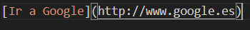

# ¿Que es Markdown?
###  _Lenguaje de marcas ligero que permite formatear textos planos de una forma sencilla_  

#### Principales Comandos:  

|Sintaxis |ejemplo |explicacion |
|:-- |:----: |:---:|
||| tipos de encabezados y tamaños de fuente"
||  |Ejemplo de comentario dentro del fichero de configuracion del markdown|
|||Hay distintos tipos de caligrafia que podemos utilizar el markdow por ej * simple es cursiva, la doble * negrita y la triple ambas|
|||Distintos tipos de listas que podemos utilizar en markdown |
|||Formato de lista enumerada|
| | |Hipervinculos|
|||El Markdown posee distintas formas de separar con lineas |
|||Ejemplo de una imagen|

|| aligned | centered | aligned  |  

